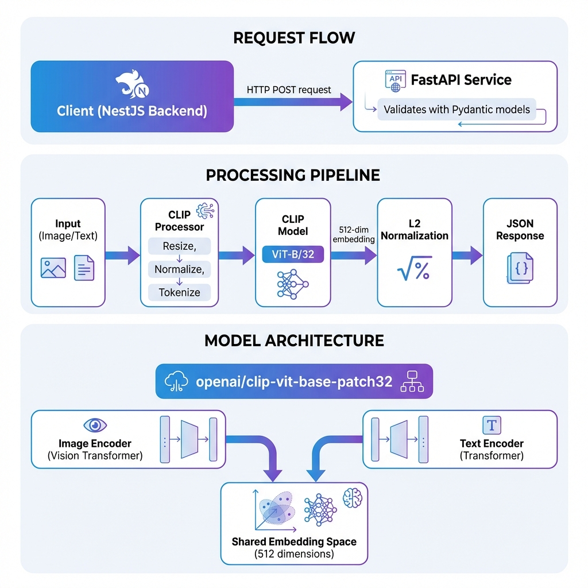

# CLIP Image Search Service

Python FastAPI service for encoding images and text using the OpenAI CLIP model. This service enables high-performance visual search and cross-modal embedding generation.



## Documentation

### 1. Quick Overview
Read [SUMMARY.md](./docs/SUMMARY.md) for a concise explanation of the service.
- Brief explanation of the CLIP service.
- Core components and request flow.
- Suitable for beginners.

### 2. Technical Details
Read [IMPLEMENTATION_GUIDE.md](./docs/IMPLEMENTATION_GUIDE.md) for a deep dive.
- Full technical specifications.
- Explanation of models and selection.
- Detailed processing flow.

### 3. Examples and Testing
Read [EXAMPLES.md](./docs/EXAMPLES.md) for usage patterns.
- Practical cURL examples.
- Integration guide for NestJS.
- Batch processing and database query examples.

### 4. Getting Started
Follow the instructions below to run the service locally or via Docker.

---

## Installation

### Prerequisites
- Python 3.9+
- 2GB RAM minimum

### Local Development
```bash
# Install dependencies
pip install -r requirements.txt

# Run the service
python main.py
```

### Docker
```bash
docker build -t clip-service .
docker run -p 8000:8000 clip-service
```

## API Endpoints

- `GET /health`: Service health check.
- `POST /encode/text`: Convert text to embedding.
- `POST /encode/image`: Convert Base64 image to embedding.
- `POST /encode/image/upload`: Upload image file to get embedding.
- `POST /encode/batch-texts`: Batch text processing.
- `POST /encode/batch-images`: Batch image processing.

## Performance
- Text Encoding: ~20-50ms (CPU)
- Image Encoding: ~50-200ms (CPU)
- GPU Acceleration supported via CUDA.
