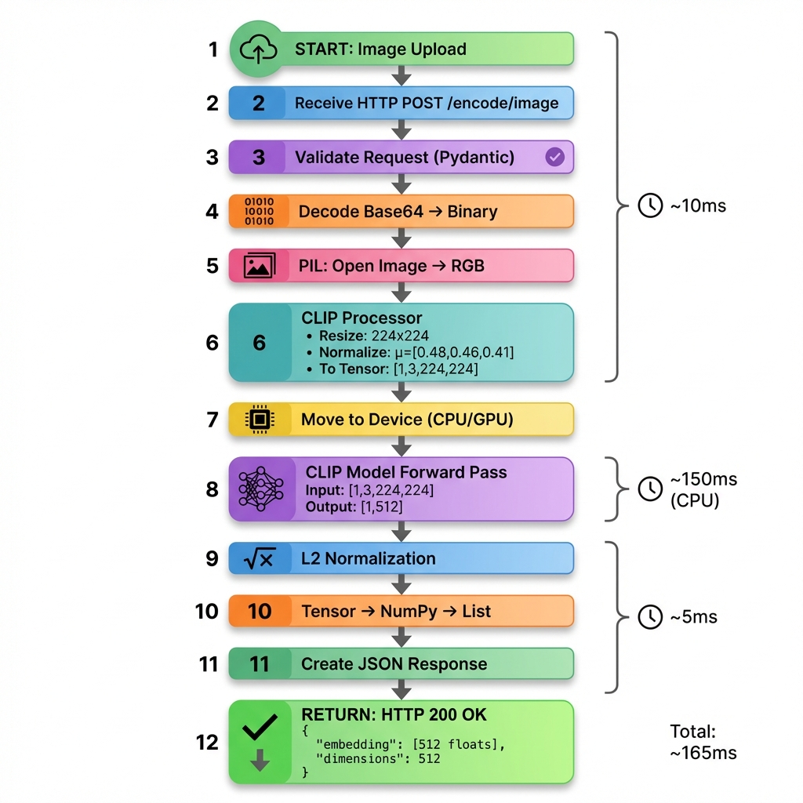

# Implementation Guide

## Technical Architecture
The service leverage FastAPI to expose CLIP model capabilities.

### Model Specification
- **Model ID**: `openai/clip-vit-base-patch32`
- **Architecture**: Vision Transformer (ViT)
- **Dimensions**: 512
- **Resolution**: 224x224 pixels

### Processing Pipeline

1. **Validation**: Input is validated using Pydantic schemas.
2. **Decoding**: Base64 strings are converted to binary image data.
3. **Preprocessing**: Images are converted to RGB and normalized using CLIP-specific mean and standard deviation.
4. **Inference**: High-performance forward pass through the neural network.
5. **Vector Post-processing**: L2 normalization ensures compatibility with cosine similarity search.

## Model Selection
Developers can select and integrate more suitable models from the [Open CLIP repository](https://github.com/mlfoundations/open_clip?tab=readme-ov-file). To switch models, modify the `model_name` variable in `main.py`.

## Configuration
- **Port**: 8000
- **Device**: Automatic detection of CUDA (GPU) or CPU.
- **Batched Processing**: Supported for both text and images to increase throughput.